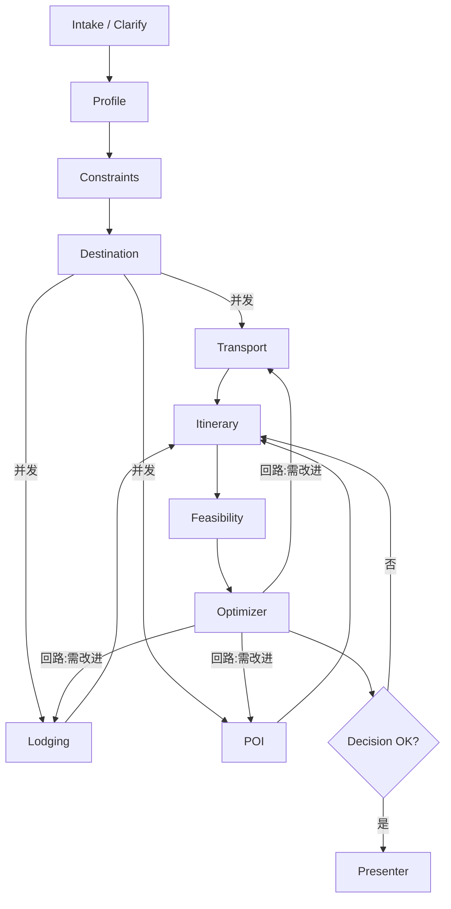

# 旅行规划多‑Agent 系统设计

> 目标：构建一个覆盖路线、景点、住宿、预算、时间、交通与玩法安排的多‑Agent 旅行规划系统，支持并发探索、约束校验、迭代优化与解释性输出。

---

## 总体思路

- 方法：采用“监督者 Orchestrator + 状态图（DAG）+ 共享黑板”的混合调度。
- 数据：以统一 Schema 管理用户画像、约束、候选方案与评分，支持来源追踪与版本管理。
- 流程：需求澄清 → 并发生成（交通/住宿/POI）→ 路线编排 → 可行性校验 → 多目标优化 → 呈现与导出。

---

## 框架选择

- LangGraph / LangChain Agents：用有向状态图表达编排、并发、循环与中断；适合复杂约束与候选集演化。
- CrewAI：以“角色 + 任务 + 流程”快速落地团队协作模型，语义清晰便于维护。
- AutoGen：会话式“提案‑评审‑修复”强；适合在关键节点引入协商循环。
- 推荐：LangGraph 执行编排与状态；CrewAI 定义角色与职责；必要时引入 AutoGen 实现提案‑批评‑修复循环。

---

## 核心角色与职责

### Orchestrator（旅行监督者）
- 职责：接单、分解目标、路由调度、质量门控与终止条件。
- 输入：用户意图与约束、黑板状态。
- 输出：调度指令、阶段任务、最终交付。
- 工具：状态图控制器、评分器、对话接口。

### Preference Agent（画像与偏好建模）
- 职责：提炼用户偏好（主题、节奏、餐饮、无障碍、避雷）。
- 输入：问答、历史行程。
- 输出：`UserProfile`、偏好权重向量。

### Budget & Constraints Agent（预算与约束管理）
- 职责：预算拆分（交通/住/玩/餐）、硬/软约束校验（签证/时窗/库存）。
- 输入：预算上限、时间窗、同行人群。
- 输出：预算切片、可行域、约束冲突报告。

### Destination & Seasonality Agent（目的地与季节性）
- 职责：生成候选城市/区域，评估季节适配与风险。
- 输入：日期、气候偏好、节日活动。
- 输出：目的地候选清单（含理由与风险标注）。

### Transport Agent（交通搜索）
- 职责：城市间/城内交通（航班/高铁/巴士/自驾/地铁/步行），联程与换乘优化。
- 输入：起讫点、时间窗、预算切片。
- 输出：候选交通方案（时长、到达时刻、成本、风险）。
- 工具：航班/铁路 API、地图时距矩阵。

### Accommodation Agent（住宿搜索）
- 职责：选定住宿簇（交通枢纽或景点簇附近）、评估性价比与安全性。
- 输入：分日停留、预算切片、POI 簇。
- 输出：酒店/民宿候选（位置、价位、评分、取消规则）。

### POI & Activity Agent（景点与玩法）
- 职责：主题聚类（自然/人文/亲子/小众）、开放时段与排队时长估计。
- 输入：偏好权重、目的地、时间窗。
- 输出：POI/活动清单（热度、停留时长、票价、最佳时段）。

### Route & Itinerary Agent（路线与日程编排）
- 职责：基于 TSP‑TW/Orienteering 思想做日程内路径与时间窗口编排，插入交通与用餐缓冲。
- 输入：POI 候选、住宿位置、时距矩阵、开放时间。
- 输出：逐日行程（时间轴、移动方式、里程、疲劳度）。

### Feasibility Agent（可行性与一致性检查）
- 职责：交叉验证预算/时窗/库存/地理可达性，标注冲突并生成修复建议。
- 输入：候选行程与账本。
- 输出：冲突列表、自动修复补丁。

### Scoring / Optimizer Agent（评分与多目标优化）
- 职责：按满意度、成本、通勤、风险、体验多样性等评分；应用 Pareto 筛选并驱动迭代。
- 输入：候选集与指标权重。
- 输出：Top‑K 行程与权衡解释。

### Presenter Agent（说明书与可视化）
- 职责：生成易读版本（日历、地图、预算清单、预订清单、注意事项）。
- 输入：最终行程。
- 输出：Markdown/HTML/PDF、地图深链、导出到日历/笔记。

> 可选扩展：风险与安全、预订、在地美食/活动探索、多人协商等 Agent。

---

## 共享状态与数据契约（Schemas）

统一黑板（Blackboard）键：`trip_context`、`user_profile`、`constraints`、`candidates[]`、`ledger`、`risks[]`、`decisions[]`。所有对象带 `version`、`source`、`confidence`。

```jsonc
// UserProfile
{
  "themes": ["自然","小众","美食"],
  "pace": "适中",           // 轻松 | 适中 | 紧凑
  "avoid": ["高强度步行","长时间排队"],
  "meal_prefs": ["本地小馆","清真"],
  "weights": { "cost": 0.25, "time": 0.2, "poi": 0.3, "comfort": 0.15, "risk": 0.1 }
}

// Constraints
{
  "budget_total": 12000,
  "dates": { "depart": "2025-10-01", "return": "2025-10-06" },
  "party": { "adults": 2, "kids": 1 },
  "visa": null,
  "must_include": ["环球影城"],
  "must_exclude": ["红眼航班"]
}

// CandidateItinerary（简化）
{
  "days": [
    {
      "date": "2025-10-02",
      "items": [
        { "type": "move", "from": "PEK", "to": "酒店", "start": "09:00", "end": "10:00", "transport": "地铁" },
        { "type": "poi", "name": "博物馆", "start": "10:30", "end": "12:00", "cost": 80 },
        { "type": "meal", "name": "本地小馆", "start": "12:15", "end": "13:00", "cost": 60 }
      ]
    }
  ],
  "metrics": { "cost_total": 5200, "travel_hours": 9.4, "queue_hours": 2.1, "variety": 0.72, "fatigue": 0.35, "risk": 0.12 },
  "ledger": [ { "category": "flight", "amount": 2600 }, { "category": "hotel", "amount": 1800 } ],
  "conflicts": [],
  "score": 0.81
}
```

---

## 编排与协作模式（LangGraph 拓扑）



- 并发与同步：目的地确定后，交通/住宿/POI 并发搜索；Itinerary 在具备最小必要数据（时距矩阵、开放时间、住宿中心）后即可生成首版。
- 回路节点：Feasibility 与 Optimizer 驱动“批评‑修复”与二次搜索；Orchestrator 维持 Top‑K 候选进入下一轮。
- 超时与降级：Agent 超时则回退至规则模板或缓存方案。

---

## 端到端工作流

1. 需求澄清：Orchestrator 驱动 Preference/Constraints 做最少问答，固化 `UserProfile` 与 `Constraints`。
2. 粗粒度探索：Destination 产出候选；Transport/Lodging/POI 并发各给 3‑5 个高质量选项。
3. 初版编排：Itinerary 生成 2‑3 份可行行程（轻松/均衡/高效）。
4. 校验与优化：Feasibility 找出冲突并给出修复补丁；Optimizer 按权重打分，保留 Pareto 前沿。
5. 协商回路：若未达阈值或用户反馈变化，定向回滚至对应 Agent（如超支 → 降档交通/住宿）。
6. 定稿与呈现：Presenter 输出最终行程与预算、地图、日历、预订清单；可选触发 Booking。

---

## 评分与多目标优化

- 指标：成本、通勤时长、排队时长、兴趣匹配、多样性、疲劳度、风险。
- 评分：归一化 + 用户权重；规则奖励/惩罚（如餐饮/休息覆盖、晚到早起惩罚）。
- 搜索：Top‑K beam + 局部替换（交换/插入/删除 POI）、交通/住宿档位切换；保留 Pareto 前沿避免早收敛。

---

## 冲突处理与回退策略

- 约束冲突：时间窗/闭馆/库存/预算 → Feasibility 标注；Itinerary 局部重排并请求替代项。
- 数据不全：缺少开放时段/票价 → 用估计分布 + 置信度标注；Presenter 透明提示。
- 高风险：天气/罢工/节假日拥挤 → 触发目的地/日期替代建议或时段平移。

---

## 工具与数据源抽象

- 地图与路网：时距矩阵、步行可达、历史/实时拥堵。
- 供应侧：航班/铁路/巴士、酒店、门票/活动。
- 本地数据：开放时间、排队时长、节日表、区域安全指数、餐饮评分。
- 统一 Offer 接口：`query -> Offer[]`，包含 `price`, `time_window`, `location`, `inventory`, `policies`, `confidence`，便于统一校验。

---

## 对话与人机在环

- 最少干预问答：预算范围、节奏、必去/避雷、饮食与无障碍。
- 可解释与可控：重大取舍附“为什么”，允许调整权重或切换模式（性价比/舒适/高效）。
- 快速迭代：可锁定已确定要素（如已出票），对其余部分重优化。

---

## 落地实现建议

### 首版（2‑3 周）
- 用 CrewAI 建模 7 个核心 Agent（Orchestrator / Preferences / Constraints / Transport / Lodging / POI / Itinerary，Feasibility+Presenter 可合并）。
- 用 LangGraph 编排：Intake → 并发搜索 → 编排 → 校验 → 优化 → 呈现，Top‑K = 3。
- 先用本地样例/缓存数据代替真实 API；实现评分与简单局部搜索。

### 升级路线
- 引入 AutoGen 做“提案‑评审‑修复”循环与复杂谈判。
- 接入真实供应 API 与地图矩阵；添加风险 Agent 与 Booking 流程。
- 增加多人协商（偏好合并与投票）、行中重规划（实时事件触发）。

---

## 附：最小示例（伪代码）

```python
# LangGraph-style nodes
nodes = [
  Intake(), Profile(), Constraints(), Destination(),
  Transport(), Lodging(), POI(), Itinerary(),
  Feasibility(), Optimizer(), Presenter()
]

# Sketch edges
edges = [
  (Intake, Profile), (Profile, Constraints), (Constraints, Destination),
  (Destination, Transport), (Destination, Lodging), (Destination, POI),
  (Transport, Itinerary), (Lodging, Itinerary), (POI, Itinerary),
  (Itinerary, Feasibility), (Feasibility, Optimizer)
]

# Feedback loops
loops = [
  (Optimizer, POI), (Optimizer, Transport), (Optimizer, Lodging),
  (Optimizer, Itinerary)
]
```

---

## 示例输入（权重与约束）

```json
{
  "budget_total": 12000,
  "dates": { "depart": "2025-10-01", "return": "2025-10-06" },
  "party": { "adults": 2, "kids": 1 },
  "weights": { "cost": 0.3, "time": 0.2, "poi": 0.35, "comfort": 0.1, "risk": 0.05 }
}
```

> 有需要我可以基于该设计脚手架一个最小可用项目（LangGraph + CrewAI），包含角色定义、状态图、数据契约与示例流程。

